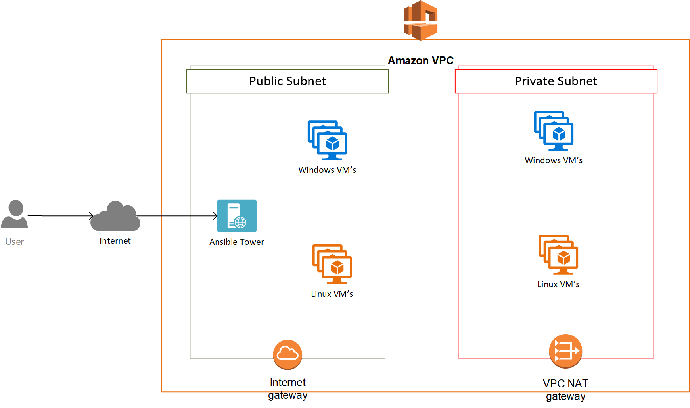

# ansible-tower-terraform

This project creates an on demand AWS deployment of Ansible Tower using Terraforms.

## Architecture


As described above, this project will create a new VPC and two subnets within that VPC. The public subnet has an internet gateway attached providing it full (inbound and outbound) internet access, while the private subnet has a NAT gateway attached providing it outbound internet access.

## Pre Requisites
You will need to have the following:

* AWS Account with appropriate access to create required resources. If you have never used AWS before you can signup for the [AWS Free Tier](https://aws.amazon.com/free/)
* [AWS CLI Tools](https://aws.amazon.com/cli/). The CLI Tools are only required for connecting to the AWS infrastructure and setting up the aws credentials. If you have access to the AWS_ACCESS_KEY_ID and AWS_SECRET_ACCESS_KEY you can set these up as environment variables to be made available to terraforms without actually installing the AWS CLI.
* [Terraform](https://www.terraform.io/)

## Clone repository
Clone the repository to your computer

```
git clone https://github.com/junaidali/ansible-tower-terraform.git
```

## Update variables
This project offers following configuration paramters

Configuration | Default Value | Notes
--- | --- | ---
aws_region | "us-east-1" | The AWS Region where resources should be created
name_tag_prefix | "TAG-PREFIX" | A tag prefix to be attached to the Name property of each AWS resource created. This is useful for shared environment where multiple users can create environments as it helps with identification and filtering within the AWS Console
vpc_cidr | "10.57.0.0/16" | This is the CIDR for the VPC
public_cidr | "10.57.10.0/24" | This is the CIDR for the public subnet
private_cidr | "10.57.11.0/24" | This is the CIDR for the private subnet
domainname | "ec2.internal" | This is the domain name suffix configured in the dhcp option set that is attached to the VPC
accessip | "0.0.0.0/0" | This is IP CIDR for the access IP's and allows SSH/RDP access to all public instances and web access on port 443 to the ansible tower server. It is currently set to allow global access. If you need additional security you can restrict it to known IP addresses.
key_name | "KEY-NAME" | This is the SSH key name used for the keypair within AWS
public_key_path | "~/.ssh/id_rsa.pub" | This is the public key that will be used for accessing all resources. Make sure you have access to the private key.
tower_version | "3.4.3-1" | This is the version of Ansible tower you will like to install.
tower_server_count | 1 | This is the number of Ansible Tower servers you need to deploy. Currently it only works with a single server. In future versions we will support Ansible Tower HA cluster.
tower_instance_type | "t2.medium" | This is the instance type for the ansible tower server
tower_root_partition_size | 20 | This is the disk size for the ansible tower server
aws_resource_owner_name | "OWNER-NAME" | This is the Owner tag set for all AWS resources
public_nodes_count | 1 | This is the count of public linux inventory hosts that should be created using the [Amazon Linux 2 AMI](https://aws.amazon.com/amazon-linux-2/)
private_nodes_count | 1 | This is the count of private linux inventory hosts that should be created using the [Amazon Linux 2 AMI](https://aws.amazon.com/amazon-linux-2/)
public_win_nodes_count | 1 | This is the count of public windows inventory hosts that should be created using the [Windows Server 2019 AMI](https://aws.amazon.com/windows/products/ec2/windows-server-2019/)
node_instance_type | "t2.nano" | This is the instance type for the linux inventory hosts
win_node_instance_type | "t2.micro" | This is the instance type for the windows inventory hosts

## Deploy infrastructure
Change directory into the project
```
cd ansible-tower-terraform
```

Initialize Terraform
```
terraform init
```

Check Terraform Plan
```
terraform plan
```

Apply infrastructure
```
terraform apply
```

Confirm to create infrastructure. Once the infrastructure is created it will output the public IP address of the tower server and the randomly generated adminsitrator password. Use this to connect to the tower using https://TOWER-IP-ADDRESS. The default administrator's username is "admin"

## Destory Infrastructure
With any cloud based service you will incure usage costs, so destory the environment once you are done.
```
terraform destroy
```
If you are sure, confirm to destroy all resources created as part of this project.